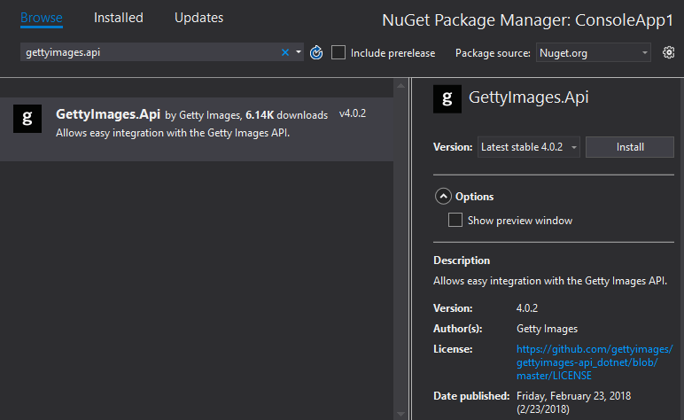

# Getty Images API SDK - .NET
[](https://travis-ci.org/gettyimages/gettyimages-api_dotnet)

## Introduction
This SDK makes using the Getty Images [API](http://developers.gettyimages.com) easy. It handles credential management, makes HTTP requests and is written with a fluent style in mind. The [API Documentation](https://github.com/gettyimages/gettyimages-api) is located on Github.

## Getting started
### Using the Nuget Package
The SDK is published to the public [Nuget](https://www.nuget.org/packages/GettyImages.Api/) package repository.

Open the package manager and add the package to your project:


## Usage
The SDK currently supports:
+ Searching for images
+ Getting image metadata
+ Creating download URLs
 
_Note; if you are using the SDK in MVC, be sure to use the async keyword on your controller's action method._

### Code
The SDK supports async operations, however it can also be used synchonously, such as when running in a console application:

```csharp
var client = ApiClient.GetApiClientWithClientCredentials("my_api_key", "my_api_secret");
var searchResult = client.Search()
    .Images()
    .Editorial()
    .WithEditorialSegment(EditorialSegment.News)
    .WithPhrase("all vocabulary")
    .WithSortOrder("newest")
    .ExecuteAsync()
    .Result;

foreach (var image in searchResult.images)
{
    Console.WriteLine("Title: {0} \r\nId: {1}", image.title, image.id);
}
````

Results are returned as `dynamic`. Visit the [API Interactive Documentation](https://api.gettyimages.com/swagger) to learn more about available parameters and to see what the response object look like.

### Building From Source Code
_This is only necessary if you would like to contribute to the project. Otherwise, use the [Nuget Package](#using-the-nuget-package)_

#### Assumptions
+ You have [.NET Core 2.0](https://www.microsoft.com/net/learn/get-started/windows) or later installed
+ You have [Git](https://git-scm.com/downloads) installed

#### Clone the repository
The Git repository contains a submodule which requires some special handling to get setup properly. This is because we share our scenario files across all our SDKs.

Open a console window (Command Prompt, PowerShell or Bash) and issue the following commands to clone the Git repository:

	git clone git@github.com:gettyimages/gettyimages-api_dotnet.git
	cd gettyimages-api_dotnet

#### Build

```sh
dotnet restore
dotnet build
dotnet test UnitTests/
```

